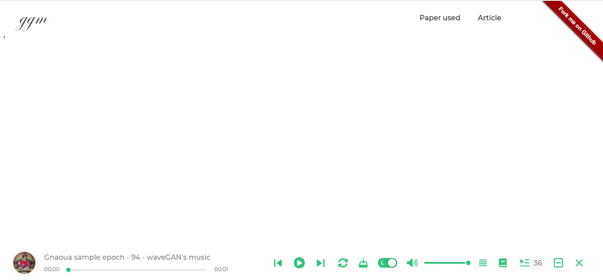

# ggm - Generate Gnaoua Music




### Install dependencies

1. Install npm packages
    ```
    $ npm install
    ```
2. Create a virtual env and activate.
    ```
    $ virtualenv venv
    $ . venv/bin/activate
    ```
    _Note: venv\Scripts\activate for windows_

3. Install python packages required to build components.
    ```
    $ pip install -r requirements.txt
    ```
4. Install the python packages for testing (optional)
    ```
    $ pip install -r tests/requirements.txt
    ```

### Write your component code in `src/lib/components/MusicComponent.react.js`.

- The demo app is in `src/demo` and you will import your example component code into your demo app.
- Test your code in a Python environment:
    1. Build your code
        ```
        $ npm run build
        ```
    2. Run and modify the `app.py` sample dash app:
        ```
        $ python app.py
        ```
- Write tests for your component.
    - A sample test is available in `tests/test_usage.py`, it will load `usage.py` and you can then automate interactions with selenium.
    - Run the tests with `$ pytest tests`.
    - The Dash team uses these types of integration tests extensively. Browse the Dash component code on GitHub for more examples of testing (e.g. https://github.com/plotly/dash-core-components)
- Add custom styles to your component by putting your custom CSS files into your distribution folder (`music_component`).
    - Make sure that they are referenced in `MANIFEST.in` so that they get properly included when you're ready to publish your component.
    - Make sure the stylesheets are added to the `_css_dist` dict in `music_component/__init__.py` so dash will serve them automatically when the component suite is requested.
