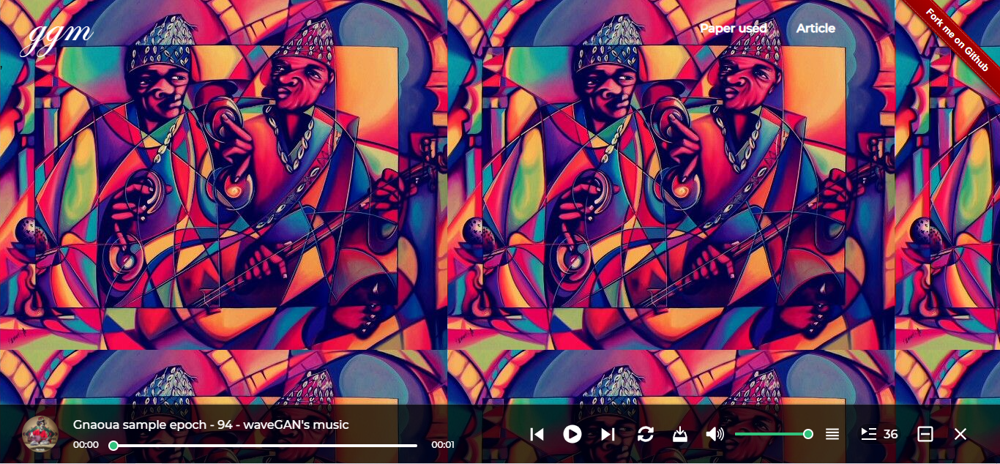

# ggm - Generate Gnaoua Music




### Install dependencies

1. Install npm packages
    ```
    $ npm install
    ```
2. Create a virtual env and activate.
    ```
    $ virtualenv venv
    $ . venv/bin/activate
    ```
    _Note: venv\Scripts\activate for windows_

3. Install python packages required to build components.
    ```
    $ pip install -r requirements.txt
    ```
4. Install the python packages for testing (optional)
    ```
    $ pip install -r tests/requirements.txt
    ```

### development

- Test your code in a Python environment:
    1. Build your code
        ```
        $ npm run build
        ```
    2. Run and modify the `app.py` sample dash app:
        ```
        $ python app.py
        ```